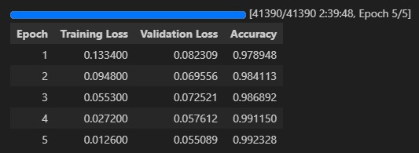

# AI and Human Image Classification Model - v1
A fine-tuned model trained on 60,000 AI-generated and 60,000 human images.
Detailed Training Code is available here: [blog/ai/fine-tuning-siglip2](https://exnrt.com/blog/ai/fine-tuning-siglip2/)

## Evaluation Metrics



### 🏋️‍♂️ Train Metrics
- **Epoch:** 5.0  
- **Total FLOPs:** 51,652,280,821 GF  
- **Train Loss:** 0.0799  
- **Train Runtime:** 2:39:49.46  
- **Train Samples/Sec:** 69.053  
- **Train Steps/Sec:** 4.316  

### 📊 Evaluation Metrics (Fine-Tuned Model on Test Set)
- **Epoch:** 5.0  
- **Eval Accuracy:** 0.9923  
- **Eval Loss:** 0.0551  
- **Eval Runtime:** 0:02:35.78  
- **Eval Samples/Sec:** 212.533  
- **Eval Steps/Sec:** 6.644

### NOTE: Users report
Some users reported overfitting issues

### 🔦 Prediction Metrics (on test set):

```
{
  "test_loss": 0.05508904904127121,
  "test_accuracy": 0.9923283699296264,
  "test_runtime": 167.1844,
  "test_samples_per_second": 198.039,
  "test_steps_per_second": 6.191
}
```

* Final Test Accuracy: 0.9923
* Final Test F1 Score (Macro): 0.9923
* Final Test F1 Score (Weighted): 0.9923

## Usage
```
pip install -q transformers torch Pillow accelerate
```
```python
import torch
from PIL import Image as PILImage
from transformers import AutoImageProcessor, SiglipForImageClassification

MODEL_IDENTIFIER = r"Ateeqq/ai-vs-human-image-detector"

# Device: Use GPU if available, otherwise CPU
device = torch.device("cuda" if torch.cuda.is_available() else "cpu")
print(f"Using device: {device}")

# Load Model and Processor
try:
    print(f"Loading processor from: {MODEL_IDENTIFIER}")
    processor = AutoImageProcessor.from_pretrained(MODEL_IDENTIFIER)

    print(f"Loading model from: {MODEL_IDENTIFIER}")
    model = SiglipForImageClassification.from_pretrained(MODEL_IDENTIFIER)
    model.to(device)
    model.eval()
    print("Model and processor loaded successfully.")

except Exception as e:
    print(f"Error loading model or processor: {e}")
    exit()

# Load and Preprocess the Image

IMAGE_PATH = r"/content/images.jpg" 
try:
    print(f"Loading image: {IMAGE_PATH}")
    image = PILImage.open(IMAGE_PATH).convert("RGB")
except FileNotFoundError:
    print(f"Error: Image file not found at {IMAGE_PATH}")
    exit()
except Exception as e:
    print(f"Error opening image: {e}")
    exit()

print("Preprocessing image...")
# Use the processor to prepare the image for the model
inputs = processor(images=image, return_tensors="pt").to(device)

# Perform Inference
print("Running inference...")
with torch.no_grad(): # Disable gradient calculations for inference
    outputs = model(**inputs)
    logits = outputs.logits

# Interpret the Results
# Get the index of the highest logit score -> this is the predicted class ID
predicted_class_idx = logits.argmax(-1).item()

# Use the model's config to map the ID back to the label string ('ai' or 'hum')
predicted_label = model.config.id2label[predicted_class_idx]

# Optional: Get probabilities using softmax
probabilities = torch.softmax(logits, dim=-1)
predicted_prob = probabilities[0, predicted_class_idx].item()

print("-" * 30)
print(f"Image: {IMAGE_PATH}")
print(f"Predicted Label: {predicted_label}")
print(f"Confidence Score: {predicted_prob:.4f}")
print("-" * 30)

# You can also print the scores for all classes:
print("Scores per class:")
for i, label in model.config.id2label.items():
    print(f"  - {label}: {probabilities[0, i].item():.4f}")
```

## Output
```
Using device: cpu
Model and processor loaded successfully.
Loading image: /content/images.jpg
Preprocessing image...
Running inference...
------------------------------
Image: /content/images.jpg
Predicted Label: ai
Confidence Score: 0.9996
------------------------------
Scores per class:
  - ai: 0.9996
  - hum: 0.0004
```